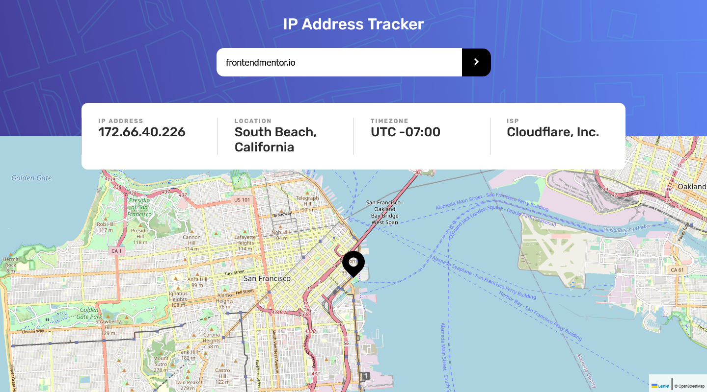

# IP Address Tracker

## Challenge

Users of this page should be able to:

- View the optimal layout for each page depending on their device's screen size
- See hover states for all interactive elements on the page
- See their own IP address on the map on the initial page load
- Search for any IP addresses or domains and see the key information and location

### Links

- [Solution]()
- [Live Site]()

### Built with

- Semantic HTML5 markup
- CSS custom properties
- Flexbox
- ES6 JavaScript
- [Leafletjs](https://leafletjs.com)
- [IP Geolocation API](https://geo.ipify.org)
- Desktop-first workflow

## Author

- Frontend Mentor [@Isaiah-B](https://www.frontendmentor.io/profile/Isaiah-B)
